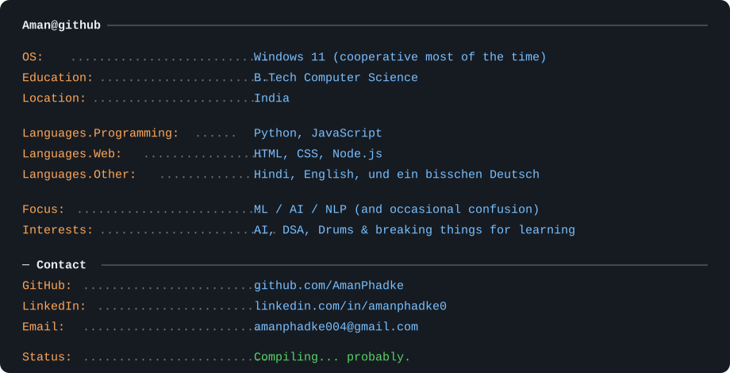

<!-- info card: plain terminal-style whoami block, no ASCII art -->

  

 
 

<!-- animated contribution graph: real data, boxes reveal cell by cell
     (regenerated daily by .github/workflows/update-profile-art.yml) -->

 

