<!-- info card: plain terminal-style whoami block, no ASCII art -->

<table>
<tr><td>

**Aman Phadke**
Final-year B.Tech CS & IT student · AI/ML Developer

- 🎓 Final-year B.Tech, Computer Science & IT, IPS Academy, Indore (RGPV, Bhopal)
- 🧠 Working across NLP, LLMs, multi-agent systems, MLOps, and computer vision
- 🌍 Based in Indore, India
- 🎯 Heading toward a graduate degree in Germany, with AI/ML engineering as an alternative path

</td></tr>
</table>

 
 

<!-- animated contribution graph: real data, boxes reveal cell by cell
     (regenerated daily by .github/workflows/update-profile-art.yml) -->

 

